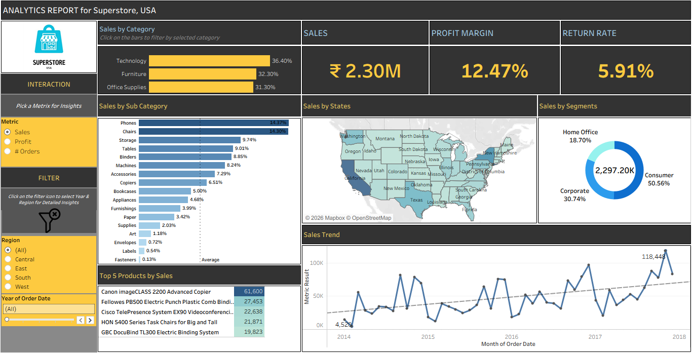

# 📊 Superstore Sales Dashboard (Tableau)

## 🔗 Overview
Interactive Tableau dashboard analyzing **sales, profit, and customer behavior** across the US.  
Helps stakeholders identify trends, performance gaps, and growth opportunities.

---

## 🎯 Business Objective
- Track **Sales, Profit, Profit Ratio, Orders**
- Analyze **Region, Category, Sub-Category, Segment**
- Identify **high-performing & loss-making areas**
- Enable **interactive, data-driven decisions**

---

## 📌 Key KPIs
- 💰 Sales: ₹2.30M  
- 📈 Profit Margin: 12.47%  
- 🔁 Return Rate: 5.91%  

---

## 📊 Dashboard Features
- Sales by Category & Sub-Category  
- Regional Sales (Map View)  
- Segment-wise Analysis (Donut Chart)  
- Sales Trend Over Time  
- Top 5 Products  
- Filters: Region, Year, Metric  

---

## 🔍 Key Insights
- 📈 Sales & Profit are growing  
- 🌍 West region is most profitable; Central underperforms  
- 🗂 Technology leads; Furniture has low/negative profit  
- 📦 Tables & Bookcases cause losses  
- 👥 Consumer segment drives highest revenue  

---

## 💡 Recommendations
- Improve margins in **Furniture**
- Reduce losses in **Tables & Bookcases**
- Replicate **West region strategies**
- Optimize **pricing & discounts**

---

## 📁 Files
- `superstore_sales_dashboard.twbx` – Tableau Dashboard  
- `sample_superstore.xls` – Dataset  
- `BRD.pdf` – Business Requirements  
- `Insights_Report.pdf` – Insights
- `superstore_sales_dashboard_ss.PNG` – Dashboard Image  

---

## 🛠 Tools
- Tableau  
- Excel  
